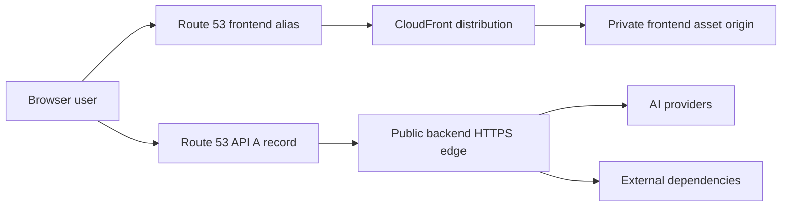
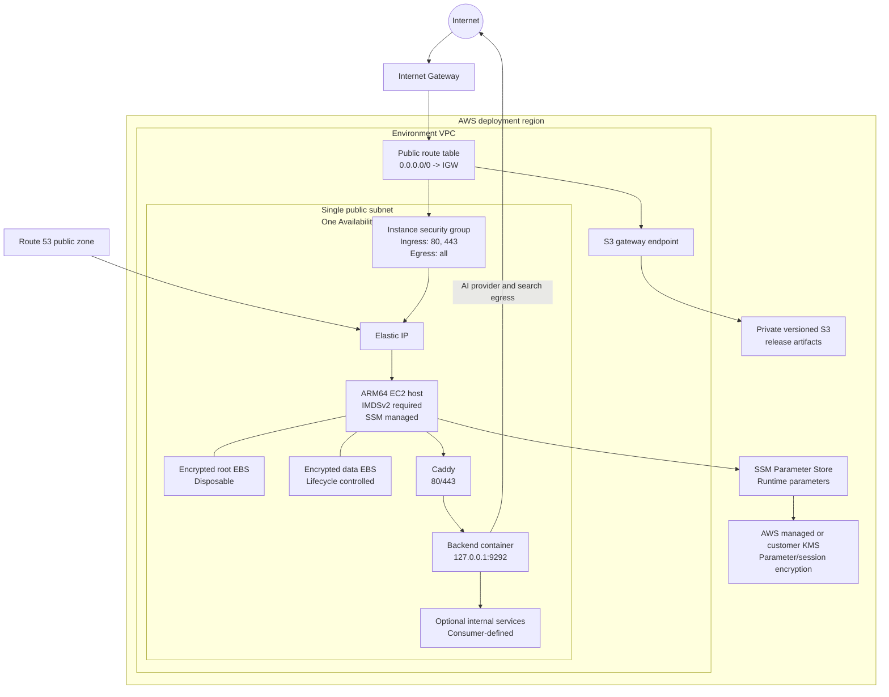
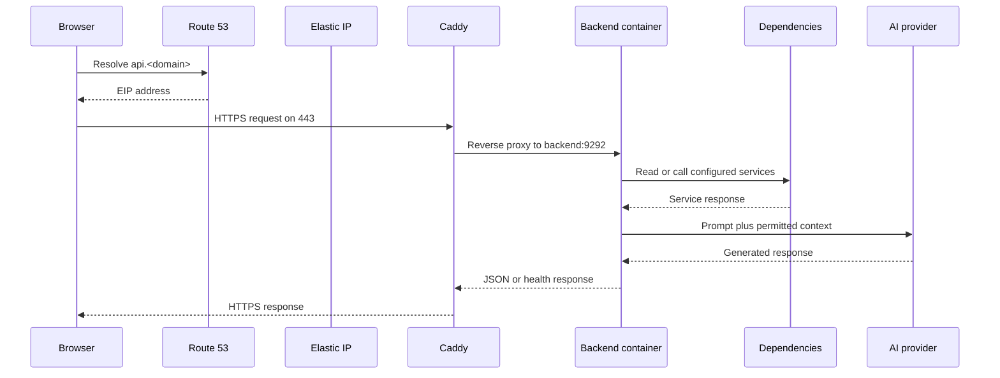
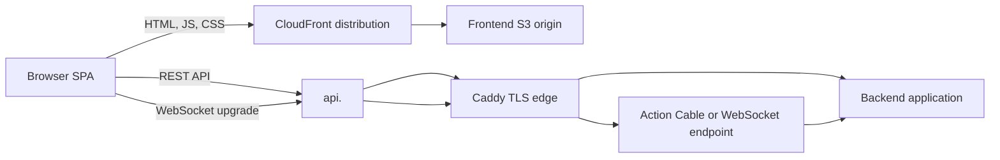
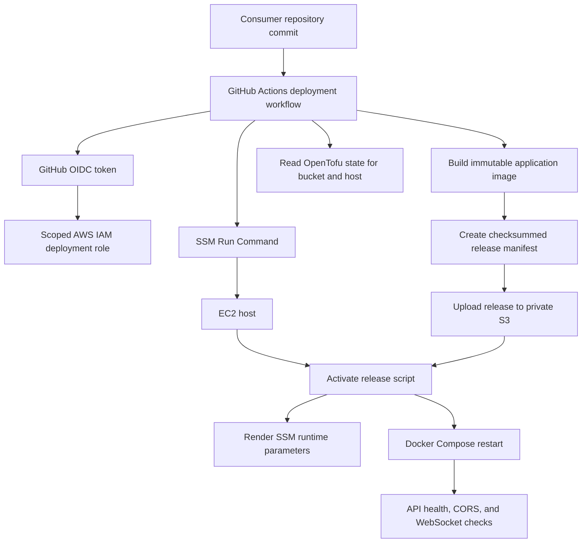
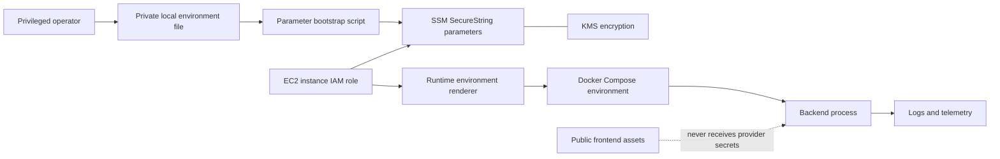
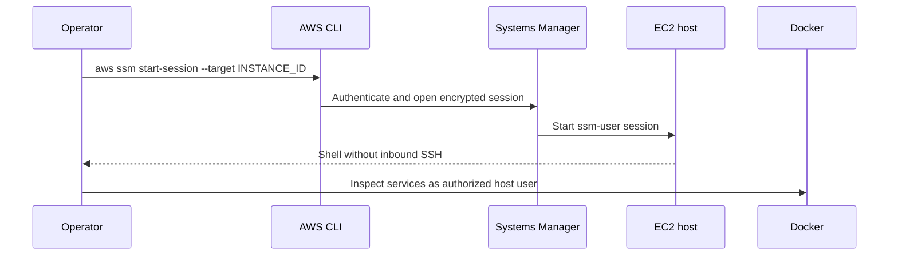
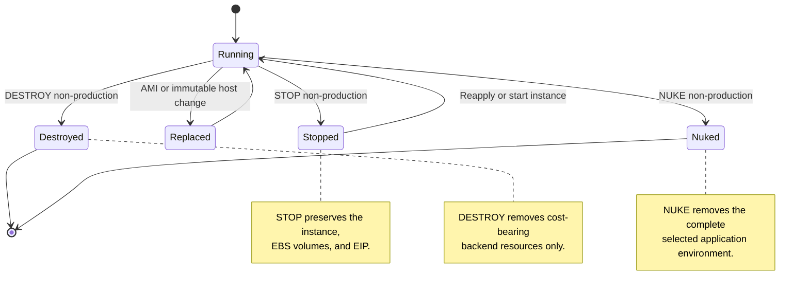

# Architecture

## Status and scope

This document describes the reusable architecture and its current
implementation boundary. Consumer-specific runtime services and application
configuration remain outside the infrastructure contract.

The design optimizes for a small, low-traffic production deployment with a
strong preference for predictable fixed costs and simple operations. It trades
multi-AZ availability, managed scaling, and managed ingress for a single public
EC2 host, an Internet Gateway, and explicit operational guardrails.

The architecture is a baseline, not a required application topology. Consumers
choose their Compose services and frontend hosting implementation while keeping
the public ingress, loopback listener, secret, and lifecycle boundaries below.

## System context

The application consists of a public frontend hosted by CloudFront/S3 and an
independent public API hostname routed to the backend EC2 host. The frontend
may use an optional non-secret `API_BASE_URL` build/runtime variable to call the
API, but frontend deployment does not require backend infrastructure. The
backend reaches consumer-selected external dependencies over outbound Internet
access. Any Redis, search, or other dependent services are internal Compose
services and are never published to the Internet.

## AWS network topology

The backend stack creates one VPC and one public subnet in one Availability
Zone. The subnet has a default route through the Internet Gateway. The S3
gateway endpoint keeps artifact traffic on AWS networking while the host still
has direct egress to configured dependencies, package mirrors, and DNS.

### Network invariants

- The security group exposes only 80 and 443.
- Docker publishes the backend listener to `127.0.0.1:9292` only.
- Consumer-defined dependent services use Compose `expose`, not host-published
  ports.
- The Internet Gateway is required for outbound provider and tool access.
- The S3 endpoint is an optimization and does not replace Internet egress.
- Session Manager replaces inbound SSH for normal administration.

## Public request and data flow

### Browser to API

The exact application endpoints belong to the consuming application. The
infrastructure contract is the TLS edge, loopback application listener, and
internal service reachability.

### Frontend and WebSocket flow

CloudFront is a separate frontend concern. Frontend IaC owns the CloudFront
distribution, frontend S3 origin, `app.<domain>` DNS alias, and us-east-1 ACM
certificate. Backend IaC owns only the API-side DNS record and backend
resources. `API_BASE_URL` is an optional configuration handoff from frontend
deployment to the SPA, not a DNS or provisioning dependency.

## Release and activation flow

Application source remains in the consuming repository. The infrastructure
repository supplies the host, artifact bucket, activation mechanism, and
verification utilities.

Consumers may call the repository's reusable workflows directly. The called
workflow checks out the selected infrastructure ref into the runner, receives
non-sensitive variables as typed input and sensitive values as named GitHub
secrets, then executes the same `bin/` script used by local operators.

Release activation is intended to be immutable and rollback-friendly:

1. Build and upload an immutable release identified by commit ID.
2. Verify the manifest and every artifact checksum on the host.
3. Render runtime parameters from SSM into a protected temporary release file.
4. Switch the `current` release symlink atomically.
5. Restart the Compose systemd service.
6. Restore the previous release if activation health checks fail.

## Secret and runtime-configuration flow

Provider credentials and optional API authentication are not frontend data.
They are written by an administrator-side bootstrap operation into an
environment-specific SSM path and read only by the EC2 instance role.

### Secret-handling rules

- Never place provider credentials in frontend build variables.
- Never print SSM values while bootstrapping or diagnosing a host.
- Only report presence, absence, or a non-sensitive status code during checks.
- Keep runtime files mode `0600` and owned by the host runtime account or root
  according to the activation contract.
- Treat logs, release manifests, plan files, and CI artifacts as potentially
  public unless access is explicitly restricted.

## Administrative access flow

The EC2 security group does not need an SSH ingress rule. Session encryption
uses the configured SSM/KMS policy where a customer-managed key is selected.

## Lifecycle and cost model

Production destruction is intentionally guarded. Non-production retention
flags control the EIP and data volume lifecycle; the root volume remains
disposable. The public project must keep these policies explicit rather than
silently choosing retention defaults.

## Extraction boundary

The following current files are the main implementation surfaces:

- `backend/main.tf` composes networking, artifacts, compute, and DNS/TLS.
- `backend/modules/networking` owns the VPC and public subnet shape.
- `backend/modules/compute` owns EC2, EBS, EIP, IAM, IMDSv2, and bootstrap.
- `backend/modules/deployment-artifacts` owns private release storage.
- `backend/modules/dns-tls` owns the backend API Route 53 record only.
- `backend/packer` owns the host base image.
- `bin/` owns administrator and release operations.
- `.github/workflows/quality.yml` owns repository quality checks.
- The remaining `.github/workflows/*.yml` files provide reusable infrastructure
  delivery entry points for consumer repositories.

Frontend consumers separately own the concrete frontend S3 bucket, CloudFront
distribution, frontend ACM certificate, and `app.<domain>` alias. This
repository provides reusable frontend infrastructure delivery workflows for
those consumer-owned resources. A shared DNS foundation owns the hosted zone
and registrar delegation; neither application stack should recreate that zone.

Application identity, hostnames, tags, SSM paths, Compose services, release
manifest shape, and GitHub OIDC policy scope are parameterized at the reusable
boundary. Do not solve this boundary with blind global string replacement;
preserve the diagrammed contracts and add consumer examples for each supported
shape.
